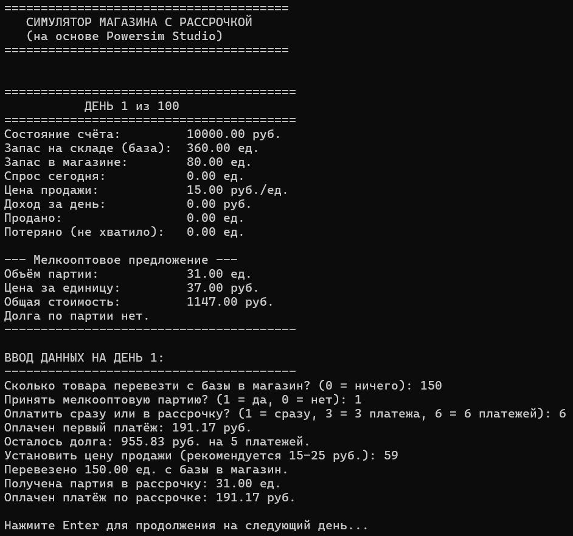
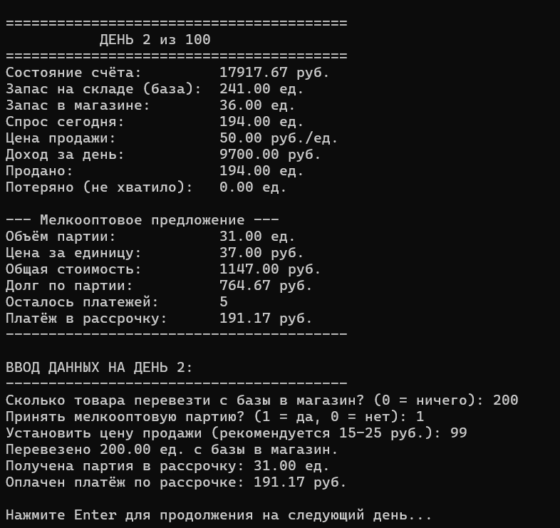

# СИМУЛЯТОР МАГАЗИНА С РАССРОЧКОЙ  
### (на основе Powersim Studio)  
**Тема: Возможность поэтапной оплаты за мелкооптовые партии**

---

## Постановка задачи

Разработать имитационную модель управления магазином с возможностью закупки мелкооптовых партий **в рассрочку** (1, 3 или 6 платежей).  
Модель должна учитывать:
- Динамику спроса в зависимости от цены;
- Перевозку товара с базы в магазин;
- Ежедневные расходы (аренда, зарплаты, налоги);
- Приём мелкооптовых партий с возможностью оплаты частями;
- Управление денежным счётом и запасами.

Цель — смоделировать 100 дней работы магазина и оценить финансовую устойчивость при использовании рассрочки.

---

## Описание модели

Модель реализована в виде **системно-динамической симуляции** на C++ с интерактивным вводом данных каждый день.

### Основные переменные состояния (уровни):
| Переменная | Описание |
|-----------|--------|
| `account` | Денежные средства на счёте |
| `basicStore` | Запас на складе (база) |
| `shopStore` | Запас в магазине |
| `offerDebt` | Текущий долг по рассрочке |
| `paymentInstallments` | Остаток платежей |

### Потоки (темпы):
- **Доход** = `sold * retPrice`
- **Продажи** = `min(shopStore, demand)`
- **Спрос** = `100 * (100 / retPrice) + шум`
- **Расходы** = `700 + 200 + 500 = 1400 руб./день`
- **Платежи по рассрочке** — равными долями

### Мелкооптовое предложение:
- Появляется **каждые 10 дней** (день 1, 11, 21…)
- Объём: **30–50 ед.** (случайно)
- Цена за единицу: **30–40 руб.**
- Возможна оплата:
  - **Сразу** (если хватает денег)
  - **В рассрочку**: 3 или 6 платежей (первый — сразу)

---

## Алгоритм программы

Программа состоит из следующих блоков:

```text
1. Получение инициализационных данных
   ├── Константы: INIT_ACCOUNT = 10000, BASIC_STORE_INIT = 360, и др.
   └── Инициализация состояния (account, shopStore, basicStore, долги = 0)

2. Инициализация
   ├── Установка начальных значений
   └── Подготовка генератора случайных чисел (через rand())

3. Основной цикл по дням (1..100)
   ├── 3.1. Генерация мелкооптового предложения (если день % 10 == 1)
   ├── 3.2. Вывод текущего состояния
   ├── 3.3. Ввод данных пользователем:
   │     ├── Сколько перевезти с базы в магазин?
   │     ├── Принять партию? (да/нет)
   │     ├── Если да → способ оплаты (сразу / 3 / 6 платежей)
   │     └── Установить цену продажи
   ├── 3.4. Расчёт уровней:
   │     ├── Перевозка: shopStore += transferVol
   │     ├── Поступление партии (если принята)
   │     ├── Расчёт спроса: demand = 100 * (100 / retPrice) + шум
   │     ├── Продажа: sold = min(shopStore, demand)
   │     └── Доход: income = sold * retPrice
   ├── 3.5. Расчёт темпов:
   │     ├── account += income
   │     ├── account -= 1400 (ежедневные расходы)
   │     └── Если есть долг → списание платежа по рассрочке
   └── 3.6. Пауза (Enter → следующий день)

4. Вывод пошаговых данных
   ├── printState() — каждые 24 часа (на экране)

5. Вывод общих данных после моделирования
   ├── Итоговый счёт
   ├── Остатки на складе и в магазине
   └── Статус долга
````

## Скриншоты

### День 1 (начало симуляции)  
  
*Кликните, чтобы открыть в полном размере:*

### День 2 (после перевозки и приёма партии в рассрочку)  
  
*Кликните, чтобы открыть в полном размере:* 

---

## Файлы проекта

| Файл | Описание |
|------|----------|
| **[Код программы](ImModLB3.cpp)** | Полный исходный код симулятора на C++ |
| **[Скриншот 1](Screenshot_1.png)** | Состояние модели в первый день |
| **[Скриншот 2](Screenshot_2.png)** | Состояние модели во второй день |
| `README.md` | Данный файл |
